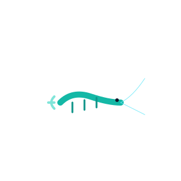

  **AI Engineer**
   

  

    
    
    
    
    
  

---

  
  

  

 

  <a href="https://[your-portfolio-link.com](https://amna-kausar.vercel.app/)">🌐 <strong>View Portfolio</strong></a> &nbsp;&nbsp;•&nbsp;&nbsp; 

